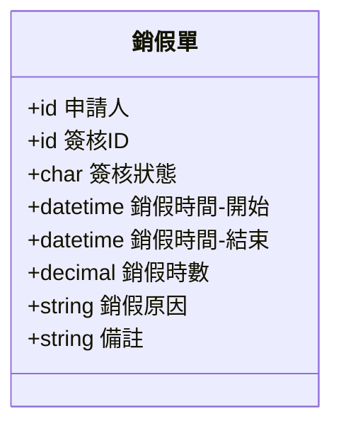

# 一 輔助

## 懶人包

### 常用指令

#### laravel 開發，重建DB

系統重建命令

```
php artisan migrate:fresh
php artisan db:seed --class=Database\\Seeders\\DevelopSeeder;
```

差勤命令

```
php artisan db:seed --class=Database\\Seeders\\AS\\ShiftDevelopSeeder;
```

#### 執行輸入序號的sql command (for 10.65.164.192)

```sql
UPDATE `sc_license` SET `main_sn` = 'AZJVF5EIAOFPD1A4I1B3-9O2OROQO5Q3W6EAQ-N5DI-VX' WHERE `sc_license`.`id` = 1;
UPDATE `sc_license` SET `wf` = 'WF-A5A6-XA4JTFKE0AQF6DEA8IJB-OCO8OTOFQPW1E2Q5-VB' WHERE `sc_license`.`id` = 1;
UPDATE `sc_license` SET `fd` = 'FD-AJA908AA-2AKJ2F6E3A9FLDNARI4B-OIOHOBO4Q0WGE9Q3-VK' WHERE `sc_license`.`id` = 1;
UPDATE `sc_license` SET `as` = 'AS-S8AY-DAMJZFEE9A3F7D6A3I9B-OMOEO0O7QCWEEHQA-VB' WHERE `sc_license`.`id` = 1;
```

#### 使用工具整理

| 名稱               | 用途          | 備註  |
| ---------------- | ----------- | --- |
| logseq           | 紀錄各類事項＆腦力激發  |     |
| ms word (office) | 文件，規格檔案     |     |
| vs code          | 開發工具        |     |
| Trello(web)      | 協同作業，進度管控   |     |
| outlook(web)     | 郵件，訊息       |     |
| joplin           | 文字編輯        |     |
| postman          | 開發工具        |     |
| one drive(web)   | 系統工具        |     |
| markflow(web)    | 設計，規劃工具     |     |
| typora           |             |     |

## xdebug for laravel 使用 vscode

#xdebug #ssh #laravel #php

### 說明：在vs code 上使用xdebug

環境 : 使用vscode以 ssh remote 的方式連接server上面的程式資料

- ### 步驟1：安裝server side 的xdebug套件，在主機端執行
  
  -
  
  ```shell
   sudo  yum install php-xdebug
  ```

- ### 步驟2：修改php.ini ,找到 /etc/php.ini 加入以下文字
  
  -
  
  ```ini
  [xdebug]
  
  zend_extension = /usr/lib64/php/modules/xdebug.so
  
  xdebug.mode = debug
  
  xdebug.start_with_request = yes
  ```

- ### 步驟3：vs cdoe 安裝套件   php debug & phpuniot test explorer

- ### 步驟4：
  
  - 開啟vs code , 點選左側的debug viewer(執行與偵錯)，建立lanuch.json ,新增組態
    -
    
    ```json
    {
      "name": "Listenfor XDebug",
      "type": "php",
      "request": "launch",
      "port": 9003,
    }
    ```

- 只要啟動除錯，然後建立中斷點，當使用browser瀏覽畫面時，只要執行到中斷點程式，就會中斷在該處。

- 重新啟動伺服器，重新連接server and debug
  -
  
  -

- 參考連結 
  
  https://medium.com/@s73obrien/setting-up-vs-code-to-develop-through-ssh-remotely-can-be-a-bit-intimidating-but-you-can-do-it-c4e9b2b42190

## unit test 開發中，錯誤問題描述

### 錯誤狀況1

```php
x: Cannot load Xdebug - it was already loaded
Xdebug: [Step Debug] Could not connect to debugging client. Tried: localhost:9003 (through xdebug.client_host/xdebug.client_port).
Class NoneClockTest cannot be found in /data/newprooa/tests/Feature/AS/NoneClockTest.php
```

解決方法：此錯誤發生在檔名和class名稱不一致，unit test 無法找到物件

## 轉換工具，使用postman app匯出的json檔，轉換成excel

### 將postman collection 轉成excel

參考連結 

[https://github.com/whyDontI/PTOE-Postman-Collection-To-Excel-CLI#readme]: 

```
A CLI to convert Postman Collection Json file to Excel (Note: Work in progress!)

Usage
    $ ptoe <input>
  Options
    --help, -h
    --file, -f Path to collection.json file
  Examples
    $ ptoe --file collection.json
    Excel file generated
Install

npm i -g ptoe
```

## 設定hosts

### windows

在目錄下 \windows\system32\drivers\etc 下面，開啟檔案 hosts 編輯內容，新增一行如下

> 192.168.1.1   dmain_name

### Mac OS

在目錄   /private/etc 下，開啟檔案　hosts ，新增一行如windows作法

### linux

設定hosts , 檔案位於 /etc/hosts

### linux設定domain name

使用hostnamectl 命令，執行

> hostnamectl set-hostname mydomain-name

## 序號環境設定

### 序號資料

```shell
序號 new prooa -- IP http://10.65.164.192/
    主序號 AZJVF5EIAOFPD1A4I1B3-9O2OROQO5Q3W6EAQ-N5DI-VX
       11 電子簽核 WF-A5A6-XA4JTFKE0AQF6DEA8IJB-OCO8OTOFQPW1E2Q5-VB  
      11-1 表單設計器 FD-AJA908AA-2AKJ2F6E3A9FLDNARI4B-OIOHOBO4Q0WGE9Q3-VK
     AS-S8AY-DAMJZFEE9A3F7D6A3I9B-OMOEO0O7QCWEEHQA-VB

domain --> oa3.local

主序號 VO19CJY1V6341EYU-5O6O9OIORQ1WBEKQ-M5DT-CL
11 電子簽核 WF-A2AZ-OV81VC5YEVD3L18Y-OVO9OIO4Q3W8ETQU-VZ
11-1 表單設計器 FD-A4A408AO-ZV613CEY8V23A1YY-O0OROYOAQTWKEOQZ-VB
21 差勤系統 AS-SCAH-HVF10C4Y1V7331IY-ORO5OTOMQ8WIEIQV-VZ
31 文件管理 DM-D1A7-YV31YC7YRVI3P15Y-OOOPOTOAQDWFEEQX-VZ
```

### 執行序號的sql command

```sql
UPDATE `sc_license` SET `main_sn` = 'AZJVF5EIAOFPD1A4I1B3-9O2OROQO5Q3W6EAQ-N5DI-VX' WHERE `sc_license`.`id` = 1;
UPDATE `sc_license` SET `wf` = 'WF-A5A6-XA4JTFKE0AQF6DEA8IJB-OCO8OTOFQPW1E2Q5-VB' WHERE `sc_license`.`id` = 1;
UPDATE `sc_license` SET `fd` = 'FD-AJA908AA-2AKJ2F6E3A9FLDNARI4B-OIOHOBO4Q0WGE9Q3-VK' WHERE `sc_license`.`id` = 1;
UPDATE `sc_license` SET `as` = 'AS-S8AY-DAMJZFEE9A3F7D6A3I9B-OMOEO0O7QCWEEHQA-VB' WHERE `sc_license`.`id` = 1;
```

oa3.local

```sql
UPDATE `sc_license` SET `main_sn` = 'VO19CJY1V6341EYU-5O6O9OIORQ1WBEKQ-M5DT-CL' WHERE `sc_license`.`id` = 1;
UPDATE `sc_license` SET `wf` = 'WF-A2AZ-OV81VC5YEVD3L18Y-OVO9OIO4Q3W8ETQU-VZ' WHERE `sc_license`.`id` = 1;
UPDATE `sc_license` SET `fd` = 'FD-A4A408AO-ZV613CEY8V23A1YY-O0OROYOAQTWKEOQZ-VB' WHERE `sc_license`.`id` = 1;
UPDATE `sc_license` SET `as` = 'AS-SCAH-HVF10C4Y1V7331IY-ORO5OTOMQ8WIEIQV-VZ' WHERE `sc_license`.`id` = 1;
UPDATE `sc_license` SET `dm` = 'DM-D1A7-YV31YC7YRVI3P15Y-OOOPOTOAQDWFEEQX-VZ' WHERE `sc_license`.`id` = 1;
```

## 分散式服務

### 可分離的服務

虛擬機器（異地機器上執行）--建立開發測試環境
專案管理-進度控制 （web可以達成）

### 需要本機執行的服務

編輯文件
編寫程式
測試程式

## laravel migratiion and Model sample code

### migration file sample code 

```php
<?php

use Illuminate\Database\Migrations\Migration;
use Illuminate\Database\Schema\Blueprint;
use Illuminate\Support\Facades\Schema;

return new class extends Migration
{
    /**
     * Run the migrations.
     */
    public function up(): void
    {
        Schema::create('as_draw_leave_records', function (Blueprint $table) {
            $table->id(); // ID，自動增量整數型態的主鍵

            $table->foreignId('sc_user_id')->constrained('sc_users'); // 使用者ID，bigint 型態

            $table->unsignedBigInteger('wf_work_flow_id'); // 簽核ID，bigint 型態
            $table->foreign('wf_work_flow_id')->references('id')->on('wf_work_flows');

            $table->char('status', 1); // 狀態，char 型態，長度 1
            $table->dateTime('start_date'); // 開始時間，datetime 型態
            $table->dateTime('end_date'); // 結束時間，datetime 型態
            $table->decimal('hours',4,2)->default(0.00);
            $table->string('reason', 600)->nullable()->default(''); // 事由，varchar 型態，長度 600，預設值空字串
            $table->string('note', 600)->nullable()->default(''); // 備註，varchar 型態，長度 600，預設值空字串
            
            $table->timestamps(); // 建立時間及更新時間，timestamp 型態
        });
    }

    /**
     * Reverse the migrations.
     */
    public function down(): void
    {
        Schema::dropIfExists('as_draw_leave_records');
    }
};

```


### model sample code 


```php
<?php

namespace App\Models\AS;

use App\Models\SC\Department;
use App\Models\SC\User;
use App\Models\AS\LeaveRule;

use Illuminate\Database\Eloquent\Factories\HasFactory;
use Illuminate\Database\Eloquent\Model;
use Illuminate\Database\Eloquent\Relations\BelongsTo;
use Illuminate\Database\Eloquent\Relations\HasMany;
use Illuminate\Database\Eloquent\Relations\HasOne;
use Illuminate\Database\Eloquent\Relations\BelongsToMany;
use Illuminate\Database\Eloquent\Relations\MorphToMany;
use Illuminate\Database\Eloquent\Relations\MorphTo;

class Leave extends Model
{
    use HasFactory;
    protected $table = 'as_leaves'; // 設定模型對應的資料表名稱

    protected $fillable = [
        'as_leave_rule_id' , 'name', 'description', 'status' ,'editor' ,'less_hour','in_advance', 'space_hour' , 'over_hour' ,
        'over_upload_file','per_month_enabled','per_month_limit','yearly','all_member'
    ];


    //
    public function leaveRule(): BelongsTo
    {
        return $this->belongsTo(LeaveRule::class, 'as_leave_rule_id');
    }

    
    // morphedByMany(目標表單名稱，多形名稱，中介表單名稱，中介表單上參照目標的外鍵，中介表單上參照自己的外鍵，自己的關聯鍵，目標的關聯鍵)
    // (多型)多對多: 使用者
    public function users(): MorphToMany 
    {
        return $this->morphedByMany(User::class, 'as_leaveable', 'as_leaveables', 'as_leave_id', 'as_leaveable_id');
    }

    // (多型)多對多: 部門
    public function departments(): MorphToMany
    {
        return $this->morphedByMany(Department::class, 'as_leaveable', 'as_leaveables', 'as_leave_id', 'as_leaveable_id');
    }


}

```


---


# 二​ ​開發列表

## 2.1 reference

### 2.1.1差勤系統參考資料

##### 2.1.1.1差勤系統UI結構圖 V1.0.4

###### 

##### 2.1.2ER Model V1.0.5


#### 使用方法：ctrl鍵+滑鼠左鍵

### 2.1.2[差勤系統UI結構圖](C:\Users\3120099\OneDrive\文件\wakeboxonedrive\OneDrive\dropbox\Documents\研發一\差勤laravel\差勤系統UI結構圖_v1.0.4.drawio.png)

### 2.1.3[差勤系統程式設計書PDF](C:\Users\3120099\OneDrive\文件\wakeboxonedrive\OneDrive\dropbox\Documents\研發一\差勤laravel\NewProOA_AttendanceSystem程式設計書_1.0.6.pdf)

### 2.1.4[差勤系統 ER-Model圖](C:\Users\3120099\OneDrive\文件\wakeboxonedrive\OneDrive\dropbox\Documents\研發一\差勤laravel\AS_ER-Model_V1.0.5.drawio.png)

### 2.1.5[差勤系統 統計報表規格 ](C:\Users\3120099\OneDrive\文件\wakeboxonedrive\OneDrive\dropbox\Documents\研發一\差勤laravel\統計報表\統計報表_規格書_1.0.0.docx)

### 2.1.6簽核狀態

| S   | 簽核中   |     |
| --- | ----- | --- |
| H   | 待經辦   |     |
| C   | 完成    |     |
| W   | 抽單    |     |
| R   | 被退件   |     |
| A   | 管理者撤銷 |     |

## 2.2 Newpro OA 差勤 - 統計報表

PS:[差勤系統 統計報表規格 excel file](C:\Users\3120099\OneDrive\文件\wakeboxonedrive\OneDrive\dropbox\Documents\研發一\差勤laravel\統計報表\統計報表規格_1.0.0.xlsx)

### 參考UI介面圖（SA勞檢查核作業）


### 設計畫面


### a.​出勤時數統計

​    實做程式：workhourSheet.php（暫時移除），在 collection 中 計算 特休，事假，病假等等時數， asHelpService.php

構想中的思考邏輯，列出所有假別，workhourSheet 啟動時，已經預先抓 leaves,直接調用

---

### b.請假時數統計

​    導出程式：leaveSheet，需要過**濾簽核狀**態為完成，排序為 user_id , start date

​    leaveRecord --  要group by user , as_user_leave_id , 且 status 為  C 完成，總和 時數,然後依照user leave id ，關聯出leave，計算出各個假別的總和

```php
$totalhours = LeaveRecord::select('as_leave_records.sc_user_id','as_user_leaves.as_leave_id',DB::raw('SUM(as_leave_records.total_hours) AS hours'))
->join('as_user_leaves', 'as_leave_records.as_user_leave_id', '=', 'as_user_leaves.id')
->groupBy('as_leave_records.sc_user_id','as_user_leaves.as_leave_id')
->get();
```

---

### c.加班統計

參考規格圖(OA)


參考欄位

| 名稱        | 是否要參考 | 備註  |
| --------- | ----- | --- |
| 編號        | 是     |     |
| 部門        | 是     |     |
| 姓名        | 是     |     |
| 到職日       | 否     |     |
| 假別        | 否     |     |
| 可用        | 否     |     |
| 已用        | 否     |     |
| 加班補償      | 否     |     |
| 已過期       | 否     |     |
| 本月即將過期    | 否     |     |
| 剩餘（含本月過期） | 否     |     |

**目前規格：加班時數，加班類別，事由，過期日**

:exclamation: 未有機制：加班補償

---

### d.員工假別統計

​    員工假別資料表已有完整的屬性，可以直接匯出，轉成excel. 資料表as_user_leave  .其他資訊只要關聯查詢即可。

---

### e.​刷卡紀錄

(參考規格圖 OA) https://cloud.newsoftoa.com/ 


整理的規格: 姓名，日期，上班刷卡，下班刷卡，工作時數，班別，備註，（請假？，加班？，出差？）遲到，早退

遲到時數  --> 遲到狀態

早退時數 --> 早退狀態

請假＆加班＆出差  ---  請假：統計請假時數，加班：統計加班時數，出差：無此資料

---

### f.​班表

規格：部門，員編，姓名，日期1，日期2。。。。最後日期。

日期中標示班別（代號取代），在表後說明代號。


---

## 2.3 未刷卡申請單-開發歷程紀錄

### 1 規格書已建立完成

### 2 coding 步驟

1. 建立migration - 
   1. 參考規格書建立
   2. create as_none_clock_records_table
   3. create as_none_clock_setting_table
2. 建立modal ,對應資料庫
   1. NoneClockRecord
   2. NoneClockSetting
3. 建立controller
   1. none clock records 
      1. create data 
      2. get list ( year )
      3. get item (one record)
   2. none clock record setting
      1. get data
      2. update data
4. 建立service
   1. none clock record service
   2. none clock record setting service
5. 建立repository & resource 
6. 連接 route -- 使用controller建立route
7. 產生postman request 
8. 建立 seeder ,產生預設資料

## 2.4 銷假單

### 參考規格圖（OA 銷假單 )


### 定義規格

### 銷假單規格：

1. 申請人
2. 簽核ID
3. 簽核狀態
4. 銷假時間-開始
5. 銷假時間-結束
6. 銷假時數
7. 銷假原因
8. 備註

銷假單無須設定

### 實體圖



### **front end:**

1. 首頁 -> 差勤管理-> 出勤 -> 申請表單 ->銷假單
2. 首頁 -> 電子簽核 -> 新增表單 ->銷假單


3. 系統表單 -    表單欄位：如spec ,申請人 ...

### 2 銷假申請單 coding 步驟

1. 建立migration - 
   1. 參考規格書建立
   2. create as_draw_leave_records_table
2. 建立modal ,對應資料庫
   1. DrawLeaveRecord
3. 建立controller
   1. draw leave records 
      1. create data 
      2. get list ( year )
      3. get item (one record)
4. 建立service
5. 建立repository & resource 
6. 連接 route -- 使用controller建立route
7. 產生postman request 
8. 建立 seeder ,產生預設資料


## 2.5 調班暨調休單 coding 步驟

1. 建立migration - 
   1. 參考規格書建立
   2. 產生migration file ,  create as_update_shift_records_table , 建立table
2. 建立modal ,對應資料庫，建立resource
   1. UpdateShiftRecord
   2. UpdateShiftRecordResource
3. 建立controller
   1. update shift record controller
      1. create data 
      2. get item (one record)
4. 建立service
5. 建立repository & resource 
6. 連接 route -- 使用controller建立route
7. 產生postman request 
8. 建立 seeder ,產生預設資料


## 2.6 調班暨調休單規格

### 1.platform:

newprooa

### 2.spec:

銷假申請單 – 欄位

- 申請人
- 簽核ID
- 調班日期
- 原班別
- 調班後班別
- 調班後休假
- 職務代理ID
- 事由

-調班暨調休單-系統單的 ID 為  6

### 3.front end:

1. 首頁 -> 差勤管理 -> 出勤 -> 申請表單 -> 調班暨調休單
2. 首頁 -> 電子簽核 -> 新增表單 ->調班暨調休單


### 4.back end:

#### 4-1.data table:

| 表格 | 表格中文名稱 | 調班暨調休單紀錄        |
| ---- | ------------ | ----------------------- |
|      | 表格英文名稱 | AS_Update_Shift_Records |

| 項次 | 中文欄位     | 英文欄位        | PK   | FK   | NN   | 實體型態  | 長度 | 備註說明 |
| ---- | :----------- | :-------------- | ---- | ---- | ---- | :-------- | ---- | -------- |
| 1    | 紀錄ID       | id              | Y    | Y    | Y    | bigint    |      |          |
| 2    | 使用者ID     | sc_user_id      |      | Y    | Y    | bigint    |      |          |
| 3    | 簽核ID       | wf_work_flow_id |      | Y    | Y    | bigint    |      |          |
| 4    | 調班日期     | ori_date        |      | Y    | Y    | date      |      |          |
| 5    | 原班別       | ori_shift_id    |      | Y    |      | bigint    |      |          |
| 6    | 調班後班別   | update_shift_id |      | Y    |      | bigint    |      |          |
| 7    | 調班後休假別 | day_of_type     |      |      | Y    | tinyint   |      | 註       |
| 8    | 職務代理人   | agent_id        |      | Y    |      | bigint    |      |          |
| 9    | 事由         | reason          |      |      |      | varchar   | 255  |          |
| 10   | 創建時間     | created_at      |      |      | Y    | timestamp |      |          |
| 12   | 更新時間     | updated_at      |      |      | Y    | timestamp |      |          |
|      |              |                 |      |      |      |           |      |          |

ps:1   default 0  休息日:1  例假日:2  國定假日:3  天災假:4


## 2.7 統計報表規格

### platform:

​    **newprooa**

 

### **spec:**

​    **統計報表** **–** **欄位**

**-**     **日期區間****-****開始**

**-**     **日期區間****-****結束**

**-**     **員工列表**

**-**     **匯出項目**

 

****

 

### **實體圖：**

### **front end:**

​    **1**

​    **首頁** **->** **差勤管理** **->** **統計報表**

 

​    

### **back end:**

​    **統計報表**

 

### 2.7.1 出勤時數統計

匯出欄位：部門，員編，姓名，應出勤時數，實際出勤時數，遲到，早退，特休，事假，病假….備註。

 

**規格示意圖**

****

### 2.7.2 請假統計

匯出欄位：部門，員編，姓名，起始時間，結束時間，總時數，特休，事假，病假，備註。

 

**規格示意圖**

****

 

 

### 2.7.3 **加班統計**

**匯出欄位：部門，員編，姓名，加班時數，加班類別，事由，過期日，備註。**

**規格示意圖**

 

****

 

### 2.7.4 **員工假別統計**

**匯出欄位：部門，員編，姓名，年度，假別，可用時數，使用起間****-****起始日，使用期間****-****結束日。**

**規格示意圖**

 

****

 

### 2.7.5 **刷卡紀錄統計**

規格: 部門，姓名，日期，上班刷卡，下班刷卡，工作時數，班別，備註，請假時數，加班時數，遲到，早退

 

**規格示意圖**

 


### 2.7.6 班表匯出

規格：部門，員編，姓名，日期1，日期2。。。。最後日期。

日期中標示班別（代號取代），在表後說明代號。

 

---


# 三 Newpro OA SNKEY

## 3.1 序號-開發環境

### 資料匯入

開發虛擬機 ip 10.65.164.192 , 建立以下的序號資料，作為開發使用

```shell
序號 new prooa -- IP http://10.65.164.192/
主序號 AZJVF5EIAOFPD1A4I1B3-9O2OROQO5Q3W6EAQ-N5DI-VX
11 電子簽核 WF-A5A6-XA4JTFKE0AQF6DEA8IJB-OCO8OTOFQPW1E2Q5-VB  
11-1 表單設計器 FD-AJA908AA-2AKJ2F6E3A9FLDNARI4B-OIOHOBO4Q0WGE9Q3-VK
   AS-S8AY-DAMJZFEE9A3F7D6A3I9B-OMOEO0O7QCWEEHQA-VB
```

sql command

```sql
UPDATE `sc_license` SET `main_sn` = 'AZJVF5EIAOFPD1A4I1B3-9O2OROQO5Q3W6EAQ-N5DI-VX' WHERE `sc_license`.`id` = 1;
UPDATE `sc_license` SET `wf` = 'WF-A5A6-XA4JTFKE0AQF6DEA8IJB-OCO8OTOFQPW1E2Q5-VB' WHERE `sc_license`.`id` = 1;
UPDATE `sc_license` SET `fd` = 'FD-AJA908AA-2AKJ2F6E3A9FLDNARI4B-OIOHOBO4Q0WGE9Q3-VK' WHERE `sc_license`.`id` = 1;
UPDATE `sc_license` SET `as` = 'AS-S8AY-DAMJZFEE9A3F7D6A3I9B-OMOEO0O7QCWEEHQA-VB' WHERE `sc_license`.`id` = 1;
```

oa3.local

```
主序號 VO19CJY1V6341EYU-5O6O9OIORQ1WBEKQ-M5DT-CL

 11 電子簽核 WF-A2AZ-OV81VC5YEVD3L18Y-OVO9OIO4Q3W8ETQU-VZ
11-1 表單設計器 FD-A4A408AO-ZV613CEY8V23A1YY-O0OROYOAQTWKEOQZ-VB
21 差勤系統 AS-SCAH-HVF10C4Y1V7331IY-ORO5OTOMQ8WIEIQV-VZ
31 文件管理 DM-D1A7-YV31YC7YRVI3P15Y-OOOPOTOAQDWFEEQX-VZ
```

```sql
UPDATE `sc_license` SET `main_sn` = 'VO19CJY1V6341EYU-5O6O9OIORQ1WBEKQ-M5DT-CL' WHERE `sc_license`.`id` = 1;
UPDATE `sc_license` SET `wf` = 'WF-A2AZ-OV81VC5YEVD3L18Y-OVO9OIO4Q3W8ETQU-VZ' WHERE `sc_license`.`id` = 1;
UPDATE `sc_license` SET `fd` = 'FD-A4A408AO-ZV613CEY8V23A1YY-O0OROYOAQTWKEOQZ-VB' WHERE `sc_license`.`id` = 1;
UPDATE `sc_license` SET `as` = 'AS-SCAH-HVF10C4Y1V7331IY-ORO5OTOMQ8WIEIQV-VZ' WHERE `sc_license`.`id` = 1;
UPDATE `sc_license` SET `dm` = 'DM-D1A7-YV31YC7YRVI3P15Y-OOOPOTOAQDWFEEQX-VZ' WHERE `sc_license`.`id` = 1;
```

### 

# 四 測試環境

建立4個使用者，不包括管理者

2個一般上班日，2個排班上班者-（變形工時2周）兩個互為代理者

## 4-1測試項目

### 4-1-1測試打卡

#### 4-1-1.a建立整個月的打卡紀錄-

​    然後進行有關的事項，月曆中的統計時數，出勤狀況（遲到早退），工作時數，加班，報表-統計報表。需要建立整個月的打卡紀錄，

### 4-1-2 測試假別，給假

#### 4-1-2.a

​    測試請假功能，先建立個人的假別，產生年度假別，以利請假作業。

# 五 相關文件

## 5.1 程式設計書 

檔名：NewProOA_AttendanceSystem程式設計書_1.0.6.pdf

檔案位置：\OneDrive\dropbox\Documents\研發一\差勤laravel

## 5.2 統計報表規格書

檔名：統計報表_規格書_1.0.0.docx

位置：OneDrive\dropbox\Documents\研發一\差勤laravel\統計報表


# 六 其他

## 重新測驗

### 行事曆


# 七 建立除錯seeder

## 調班暨調休- 測試

參考 app/tests/AS/UpdateShiftTest.php

1. 使用seeder 產生排班資料 ，seeder檔案為 /app/database/seeders/AS/shiftDevelopsSeeder.php
   1.    [updateShift Code](updatesiftcode.md)


2. 建立簽核，簽核的template id 為 6，取得簽核 ID
3. 使用簽核ID，建立調班暨調休單紀錄
4. 根據簽核ID ，完成簽核。
5. 檢測資料是否正確，有無調班成功。

## 角色-

階層-啟動 function - 

```

```

### 說明：

角色的權限設定，module只有第一層模組的設定，若需要module以下的設定，需要第二層參數。而func的指定與否是在角色上，因此需要在角色上多一個關聯。

# 八 薪資


